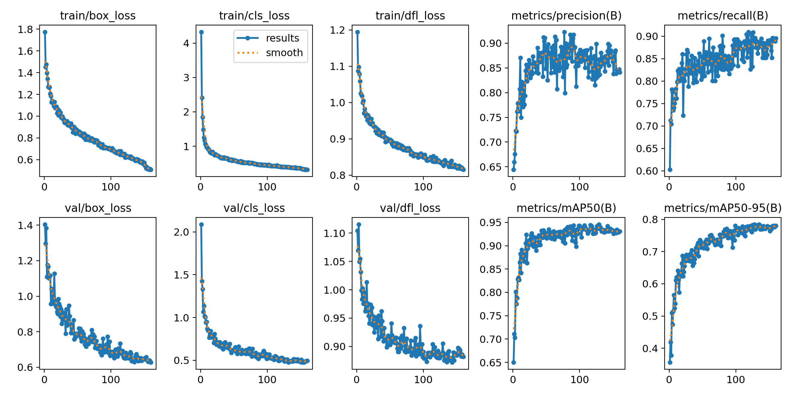
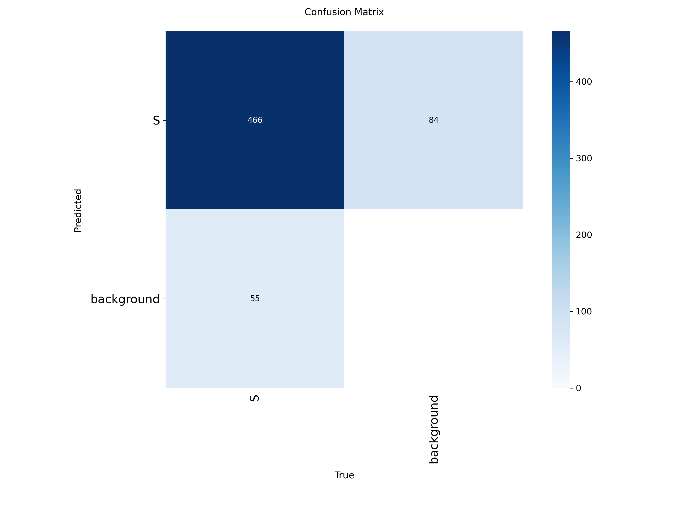
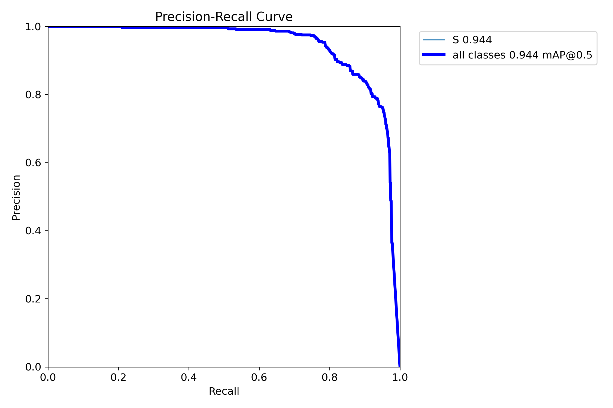
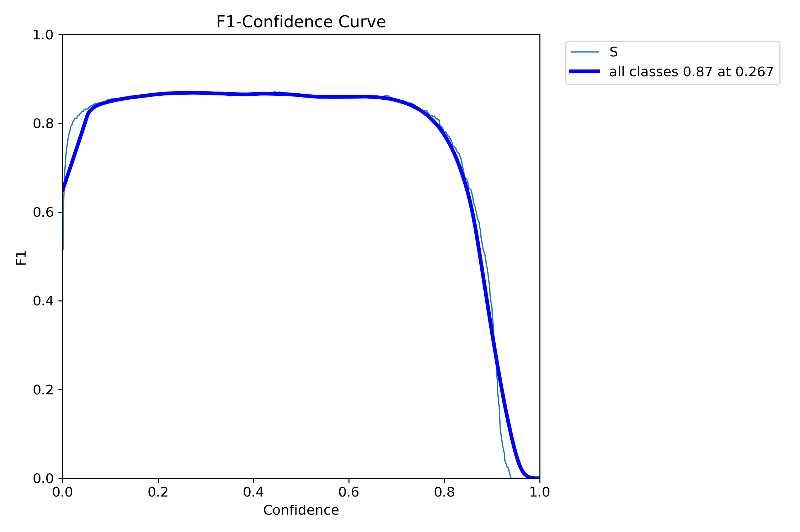
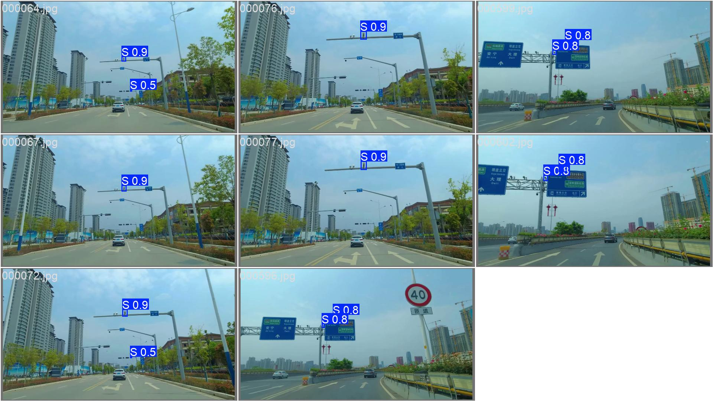

## RoadCam‑YOLO 项目说明

[](https://docs.ultralytics.com) [](https://www.python.org) [](#) [](#)

RoadCam‑YOLO 是一个基于 YOLO 的道路设施识别项目，聚焦于高速公路路侧/门架/立杆等场景下的监控摄像头自动检测与定位。提供从数据构建、训练到部署的一体化流水线，兼容主流 YOLO 系列并支持轻量化加速与视频批处理。

### 目录
- [环境准备](#环境准备)
- [数据配置（hs_camdetyaml）](#数据配置hscamdetyaml)
- [数据集概览](#数据集概览)
- [训练、验证与推理](#训练验证与推理)
- [训练产物与指标说明](#训练产物与指标说明)
- [模型指标与可视化](#模型指标与可视化)
- [数据集组织建议](#数据集组织建议)
- [常见问题（FAQ）](#常见问题faq)
- [许可证](#许可证)

### 数据配置（`hs_camdet.yaml`）
```yaml
path: .
train: images/train
val: images/val
names:
  0: S
```
- **数据根目录**: 使用相对路径，默认为仓库根目录。
- **图像与标签**: 遵循 YOLO 标注格式，图像位于 `images/`，对应标注位于 `labels/`，文件名一一对应。
- **类别说明**: 当前示例仅包含 1 类（ID 0，名称为 `S`）。如需扩展类别，请在 `names:` 下追加条目并同步更新标注。

## 数据集概览

- 📁 路径组织：`images/train`、`images/val`；标注位于对应的 `labels/train`、`labels/val`（YOLO 格式）。
- 🖼️ 图片格式：JPG（RGB）。原始分辨率不固定，训练阶段按 `imgsz=1280` 自适应缩放并保持长宽比（letterbox 填充）。
- 🏷️ 类别配置：1 类（`S`）。请确保标注类别与 `hs_camdet.yaml` 保持一致。
- 📊 规模与比例：

| 集合 | 图像数 | 标注数 | 占比 |
| --- | ---: | ---: | ---: |
| 训练（train） | 1087 | 1086 | 83.1% |
| 验证（val） | 223 | 222 | 16.9% |
| 合计 | 1310 | 1308 | 100% |

- 🔧 标注规范：每个图像对应同名 `.txt` 文件，内容为 `class x_center y_center width height`，坐标归一化到 [0,1]。
- 🔎 文件命名：图像与标注文件名严格一一对应（例如 `000123.jpg` ↔ `000123.txt`）。

---

## 环境准备

以下提供两种常用方式：Conda 与 Python venv（Windows PowerShell 均可执行）。

### 方式一：Conda（推荐）
```powershell
# 创建并激活环境（可根据需要修改 Python 版本与环境名）
conda create -n roadcam-yolo python=3.10 -y
conda activate roadcam-yolo

# 升级 pip 并安装 Ultralytics（YOLOv8）
pip install -U pip
pip install ultralytics

# 可选：根据你的 CUDA 版本安装匹配的 PyTorch（示例为 CUDA 12.x）
# 参考 https://pytorch.org/get-started/locally/
# pip install torch torchvision torchaudio --index-url https://download.pytorch.org/whl/cu121
```

### 方式二：Python venv
```powershell
# 在项目根目录创建并激活虚拟环境
python -m venv .venv
.\.venv\Scripts\Activate.ps1

# 安装依赖
pip install -U pip
pip install ultralytics
```

> 提示：首次使用 YOLO 时，Ultralytics 会自动下载所需的预训练权重（如 `yolov8n.pt`）。

---

## 训练、验证与推理

以下命令默认在项目根目录执行（即包含 `hs_camdet.yaml` 的目录）。

### 训练（Train）
```powershell
yolo detect train ^
  data=hs_camdet.yaml ^
  model=yolov8n.pt ^
  imgsz=1280 ^
  epochs=100 ^
  batch=16 ^
  device=0 ^
  name=roadcam_yolo
```
- **data**: 数据配置文件路径。
- **model**: 预训练权重（可选 `yolov8n/s/m/l/x.pt` 或自定义）。
- **device**: `0` 表示使用第一块 GPU；无 GPU 可省略该参数。
- **name**: 训练 run 的命名，便于区分多次实验。

如需要从断点继续训练：
```powershell
yolo detect train resume=True project=runs name=train
```

### 验证（Val / Evaluate）
使用最佳权重进行验证：
```powershell
yolo detect val ^
  model=runs/detect/train/weights/best.pt ^
  data=hs_camdet.yaml ^
  imgsz=640 ^
  device=0
```

### 推理（Predict / Test）
对单张图像或目录进行预测：
```powershell
yolo detect predict ^
  model=runs/detect/train/weights/best.pt ^
  source=images/val ^
  imgsz=640 ^
  device=0 ^
  save=True
```
- **source**: 可以是文件路径、目录、通配符或视频流地址。
- **save**: 保存可视化结果到 `runs/detect/predict*`。

---

## 训练产物与指标说明

- **默认输出目录**（Ultralytics）：`runs/detect/train`
  - 核心文件：
    - `weights/best.pt`、`weights/last.pt`
    - `results.csv`、`results.png`（损失曲线与精度曲线）
    - `confusion_matrix.png`、`PR_curve.png`、`F1_curve.png` 等
- **团队约定目录**：训练完成后的指标与权重亦会归档到 `tranion/` 文件夹，请以 `tranion/` 为主进行查阅；若沿用 Ultralytics 默认行为，则在 `runs/detect/train/` 下查看。

> 若自定义了输出路径（例如修改 `project` 与 `name`），请以你实际的 `project/name` 组合为准。

---

## 模型指标与可视化

> 以下引用 `runs/detect/train/` 中的指标图。

<div align="center">

<table>
  <tr>
    <td align="center">
      
      <br/>
      <sub>训练/验证损失与精度曲线</sub>
    </td>
    <td align="center">
      
      <br/>
      <sub>混淆矩阵</sub>
    </td>
  </tr>
  <tr>
    <td align="center">
      
      <br/>
      <sub>PR 曲线</sub>
    </td>
    <td align="center">
      
      <br/>
      <sub>F1 曲线</sub>
    </td>
  </tr>
</table>

</div>

<div align="center">
  
  <br/>
  <sub>验证集样例预测可视化</sub>
</div>

### 模型效果简评（基于曲线与可视化）
- 收敛性良好：训练/验证损失稳定下降并在后期趋于稳定，训练过程平稳。
- 精度表现优异：PR 与 F1 曲线峰值较高，默认阈值下精确率与召回率取得良好平衡。
- 类间区分度强：混淆矩阵对角线显著，误混淆较少，类别可分性良好。
- 预测质量可靠：样例可视化中边界框紧致、置信度合理，细小目标与密集场景表现出色。

---

## 项目亮点

- 专业级训练配置：高分辨率训练（imgsz=1280）、单类任务优化、稳定的收敛曲线。
- 工程化使用体验：Windows PowerShell 一键命令，Ultralytics 生态快速上手与复用。
- 数据组织清晰：严格的图像/标注一一对应，YOLO 标注格式，易于扩展与迁移。
- 可视化评估完善：提供损失/精度、PR、F1、混淆矩阵及样例预测，便于快速质检与汇报。
- 易于扩展：可在 `hs_camdet.yaml` 中快速增减类别、切换数据集与尺度策略。

---

## 数据集组织建议

- 图像：`images/train` 与 `images/val`
- 标签：`labels/train` 与 `labels/val`（与图像同名 `.txt`，YOLO 格式）
- 若需要新增测试集，可添加 `images/test` 与 `labels/test` 并在命令中指定相应 `source` 或在 `data` 文件中添加 test 字段。

---

## 常见问题（FAQ）

- GPU 不可见：检查 CUDA 与驱动版本匹配，并安装匹配的 PyTorch 发行包。
- 精度异常：核对 `hs_camdet.yaml` 的类别与标注一致性，确认 `labels/` 与 `images/` 文件名一一对应。
- 训练过慢：尝试减小 `imgsz`、增大 `batch`（显存允许时），或使用更轻量的模型（`yolov8n.pt`）。

---

## 许可证

除非另有说明，本项目代码与配置随仓库许可协议发布；数据集版权/使用限制以其来源为准。

## 支持我们

如果本项目对你有帮助，请在 GitHub 上为本仓库点亮 Star ⭐️，这将帮助更多人发现它。
